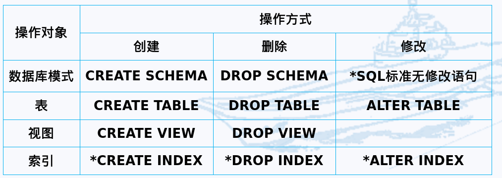

# 数据库原理

## 一、绪论

1. 概念
   
   - 数据
   
   - 数据库
   
   - 数据库管理系统
   
   - 数据库系统
   
   - 他们的关系

2. 数据管理技术的三个阶段：
   
   - 人工管理阶段：没有专门处理数据的软件   
   
   - 文件系统阶段：有专门的数据管理软件（文件系统）
   
   - 数据库系统阶段

3. 数据库系统的特点：
   
   - 数据结构化
   
   - 数据的共享性高、冗余度低且易扩充
   
   - 数据独立性高
   
   - 数据由数据库管理系统统一管理和控制：数据库管理系统必须提供：安全性保护、完整性检查、并发控制、数据库恢复功能

4. 概念
   
   - 数据模型：对现实世界数据特征的抽象，是数据库系统的核心和基础
   
   - 概念模型（信息模型）：按照用户观点对数据和信息建模
   
   - 逻辑模型：按照计算机系统的观点对数据建模，例：层次模型、网状模型、关系模型、面向对象数据模型、对象关系数据模型、半结构化数据模型
   
   - 物理模型：在系统内部或介质上的表示方法存取方法

5. 数据模型的组成要素
   
   - 数据结构
   
   - 数据操纵
   
   - 数据的完整性约束条件

6. 数据库系统的三级模式结构
   
   - 模式
   
   - 外模式
   
   - 内模式

7. 两层映像：保证了数据库系统中的数据能够具有较高的逻辑独立性和物理独立性
   
   - 外模式/模式映像
   
   - 模式/内模式映像

## 二、关系数据库

1. 概念
   
   - 域、基数
   
   - 笛卡尔积、元组、分量
   
   - 关系、目（度）、属性、候选码、主属性、非主属性（非码属性）、主码、全码

2. 关系的三种类型：基本关系（基本表）、查询表、视图

3. 基本关系6条性质

4. 关系模式

5. 关系操作：查询|插入、删除、修改，操作的对象和结果都是集合

6. 查询操作基本操作：选择、投影、并、差、笛卡尔积

7. 关系数据语言
   
   - 关系代数语言
   
   - 关系演算语言
   
   - 双重特点：结构化查询语言（SQL）

8. 关系完整性
   
   - 实体完整性
   
   - 参照完整性
   
   - 用户定义完整性

9. 关系代数 传统集合运算：并、交、差、笛卡尔积

10. 关系代数 专门的关系运算
    
    - 元组的连接、象集
    
    - 选择（限制）
    
    - 投影
    
    - 连接：等值连接、自然连接、非等值连接，悬浮元组、外连接、左外连接、右外连接
    
    - 除运算

## 三、SQL

### （一）概述

1. 目前没有数据库管理系统能支持SQL标准的所有概念和特性
2. 特点
   - 功能综合风格统一
   - 数据操纵高度非过程化
   - 面向集合的操作方式
   - 以统一的语法结构提供多种使用方式
   - 语言简洁易学易用
3. 基本概念
   - 基本表
   - 存储文件
   - 视图

### （二）数据定义

1. 模式、表、视图、索引

   

### （三）数据查询

### （四）数据更新

## 四、关系数据理论

